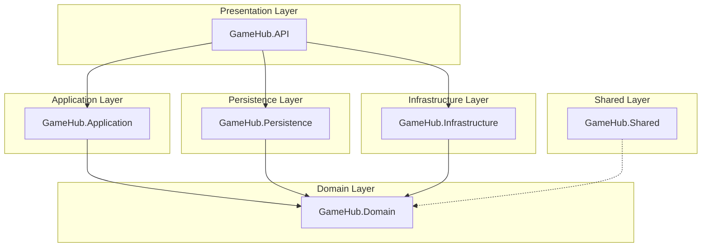
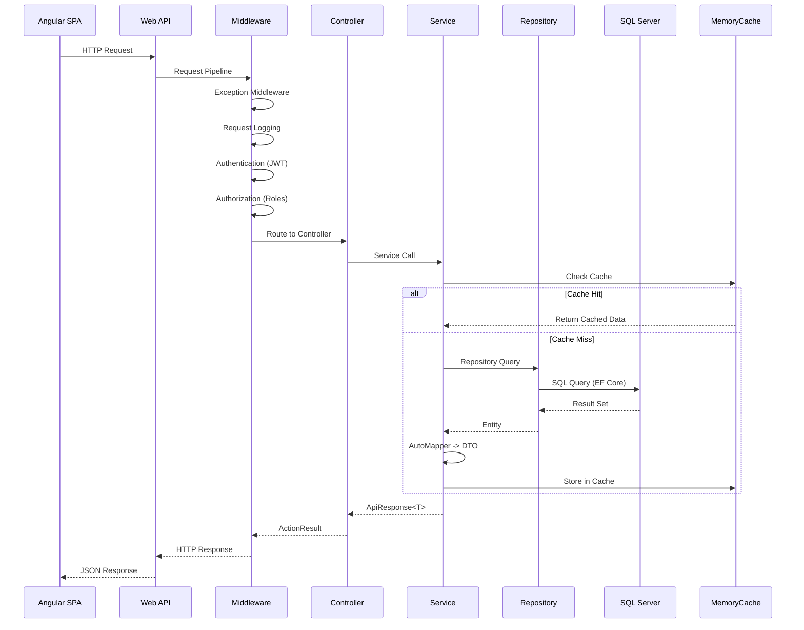
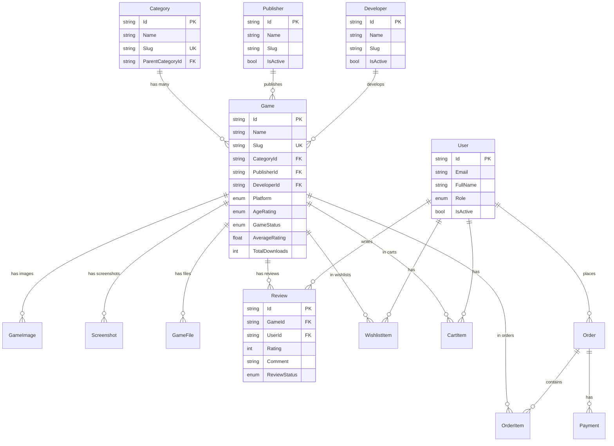
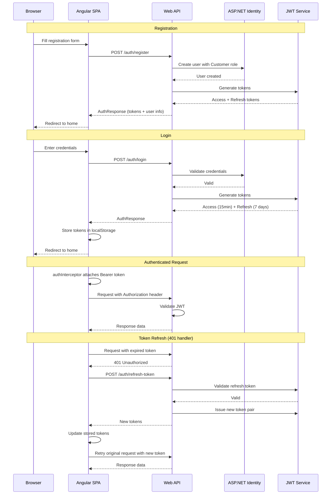

# GameHub

<p align="center">
  <a href="ttps://game-hub-pi-smoky.vercel.app">
    
  </a>
</p>

<p align="center">
  A full-stack digital game marketplace built with ASP.NET Core 10 and Angular 20, featuring Clean Architecture, JWT authentication, admin dashboard, and a modern responsive UI.
</p>

---

## Table of Contents

- [Overview](#overview)
- [Features](#features)
- [Tech Stack](#tech-stack)
- [Architecture](#architecture)
- [Project Structure](#project-structure)
- [Getting Started](#getting-started)
- [Configuration](#configuration)
- [API Endpoints](#api-endpoints)
- [Database Schema](#database-schema)
- [Authentication Flow](#authentication-flow)
- [Deployment](#deployment)

---

## Overview

GameHub is a digital game distribution platform where users can browse, discover, and download games. The platform includes a public storefront with game listings, search, filtering, reviews, and an administrative panel for managing games, categories, publishers, developers, banners, and users.

The application follows Clean Architecture principles with six .NET projects and an Angular single-page application frontend using PrimeNG component library.

---

## Features

### Public Storefront
- Game catalog with featured, trending, popular, and latest game sections
- Game search with keyword filtering
- Game detail pages with screenshots, system requirements, and store links
- User registration and authentication
- Game review and rating system
- Contact form and support pages
- Dark/light theme toggle
- Responsive design (Tailwind CSS)

### Admin Panel
- Dashboard with key metrics (users, games, reviews, downloads)
- Game CRUD with screenshot management (upload URL or file)
- Category management with hierarchical parent-child relationships
- Publisher and developer management
- Banner management (regular and hero/carousel banners)
- User management with block/unblock
- Admin account management
- Order and payment tracking
- Contact message inbox with reply functionality

### Security
- JWT-based authentication with access and refresh tokens
- Role-based authorization (SuperAdmin, Admin, Moderator, Customer)
- Automatic token refresh on 401 responses
- Soft delete for all entities (audit trail)
- Email verification and password reset flow
- Two-factor authentication support

---

## Tech Stack

### Backend

| Technology | Purpose |
|---|---|
| ASP.NET Core 10.0 | Web API framework |
| Entity Framework Core 10.0 | ORM and data access |
| SQL Server | Relational database |
| ASP.NET Core Identity | User management and authentication |
| JWT Bearer | Token-based authentication |
| MediatR | CQRS command/query pattern |
| AutoMapper | Object-to-object mapping |
| FluentValidation | Request validation |
| Serilog | Structured logging |
| MailKit | Email delivery |
| Swashbuckle | API documentation (Swagger) |

### Frontend

| Technology | Purpose |
|---|---|
| Angular 20 | Single-page application framework |
| PrimeNG 20 | UI component library |
| Tailwind CSS 3 | Utility-first CSS framework |
| TypeScript 5.8 | Typed JavaScript |
| RxJS 7.8 | Reactive programming |
| Karma / Jasmine | Unit testing |

### DevOps

| Tool | Purpose |
|---|---|
| Vercel | Frontend hosting and deployment |
| ASP.NET hosting provider | Backend hosting |
| Git | Version control |
| GitHub | Source repository |

---

## Architecture

The backend follows **Clean Architecture** with strict dependency inversion: dependencies point inward toward the Domain layer.



### Layer Responsibilities

| Layer | Responsibility |
|---|---|
| **GameHub.Domain** | Core entities, enums, repository interfaces, service contracts, base entity with soft-delete support |
| **GameHub.Application** | CQRS commands/queries, DTOs, AutoMapper profiles, FluentValidation validators, service implementations, MediatR pipeline behaviors |
| **GameHub.Persistence** | EF Core DbContext, migrations, generic repository, UnitOfWork, specialized queries, seed data |
| **GameHub.Infrastructure** | External service implementations: JWT tokens, email (MailKit), file upload (local disk), in-memory caching |
| **GameHub.API** | Controllers, middleware (exception handling, request logging), Swagger, CORS, JWT configuration, startup pipeline |
| **GameHub.Shared** | Cross-cutting concerns (currently reserved for future use) |

### Request Flow



---

## Project Structure

### Backend

```
backend/
  GameHub.slnx
  Directory.Build.props
  migration.sql
  GameHub.API/
    Controllers/
      AdminController.cs          # Dashboard, users, admin management
      AuthController.cs           # Register, login, token refresh, password reset
      BannersController.cs        # Promotional banner CRUD
      CartController.cs           # Shopping cart operations
      CategoriesController.cs     # Game category CRUD
      ContactMessagesController.cs# Contact form inbox and replies
      DevelopersController.cs     # Game developer CRUD
      GamesController.cs          # Game CRUD, screenshots, search, download
      HeroBannersController.cs    # Hero/carousel banner management
      OrdersController.cs         # Order history
      PublishersController.cs     # Game publisher CRUD
      ReviewsController.cs        # Game reviews
      UploadController.cs         # Image and file upload
    Extensions/
      ClaimsPrincipalExtensions.cs
      ServiceExtensions.cs        # DI registration, JWT, CORS, Swagger, policies
    Middleware/
      ExceptionMiddleware.cs      # Global exception handling
      RequestLoggingMiddleware.cs # HTTP request logging
    Program.cs                    # Application startup and pipeline
    appsettings.json
    appsettings.Development.json
  GameHub.Application/
    Behaviors/
      ValidationBehavior.cs       # MediatR pipeline validation
    Commands/
      Auth/                       # RegisterCommand, LoginCommand
    DTOs/
      Admin/AdminDtos.cs
      Auth/AuthDtos.cs
      Banner/BannerDtos.cs
      Common/ApiResponse.cs       # Standardized API response wrapper
      Game/GameDtos.cs            # GameDto, CreateGameRequest, UpdateGameRequest
      HeroBanner/HeroBannerDtos.cs
      Order/OrderDtos.cs
      Review/ReviewDtos.cs
    Interfaces/
      IBannerService.cs
      IGameService.cs
      IHeroBannerService.cs
    Mappings/
      MappingProfile.cs           # AutoMapper configuration
    Services/
      AuthService.cs              # Authentication business logic
      BannerService.cs
      GameService.cs              # Game CRUD with caching
      HeroBannerService.cs
    Validators/
      AuthValidators.cs
      GameValidators.cs
  GameHub.Domain/
    Common/
      BaseEntity.cs               # Id, CreatedAt, UpdatedAt, IsDeleted, DeletedAt
    Entities/
      AuditLog.cs, Banner.cs, CartItem.cs, Category.cs
      ContactMessage.cs, Coupon.cs, Developer.cs, Download.cs
      Game.cs, GameFile.cs, GameImage.cs, HeroBanner.cs
      Notification.cs, Order.cs, OrderItem.cs, Payment.cs
      Publisher.cs, Review.cs, Screenshot.cs, User.cs, WishlistItem.cs
    Enums/
      Enums.cs                    # UserRole, GameStatus, Platform, AgeRating, etc.
    Interfaces/
      ICacheService.cs, IEmailService.cs, IFileUploadService.cs
      IGameRepository.cs, IGenericRepository.cs
      ITokenService.cs, IUnitOfWork.cs
  GameHub.Infrastructure/
    Services/
      CacheService.cs             # IMemoryCache wrapper
      EmailService.cs             # MailKit SMTP implementation
      FileUploadService.cs        # Local disk file storage
      TokenService.cs             # JWT generation and validation
  GameHub.Persistence/
    Context/
      GameHubDbContext.cs          # DbContext with fluent configuration
    Extensions/
      ServiceCollectionExtensions.cs # DI registration
    Migrations/                   # EF Core migrations
    Repositories/
      GameRepository.cs           # Specialized game queries with includes
      GenericRepository.cs        # CRUD base class
      UnitOfWork.cs               # Transaction management and repository cache
    Seeds/
      SeedData.cs                 # Initial data (roles, admin, sample games)
  GameHub.Shared/
```

### Frontend

```
frontend/GameHub.Client/
  src/
    app/
      core/
        constants/
          api.constants.ts        # API URL and endpoint definitions
        guards/
          auth.guard.ts           # Route guards (auth, admin)
        interceptors/
          auth.interceptor.ts     # Bearer token attachment and refresh
          error.interceptor.ts    # Global error toast notifications
        models/
          auth.model.ts           # TypeScript interfaces (Game, User, DTOs, etc.)
        services/
          auth.service.ts         # Authentication service with signals
          cart.service.ts         # Shopping cart (placeholder)
          game.service.ts         # Centralized HTTP service
          theme.service.ts        # Dark/light theme toggle
      pages/
        admin/
          admins/                 # Admin account management
          banners/                # Banner CRUD
          categories/             # Category CRUD
          customers/              # Customer list and blocking
          dashboard/              # Admin dashboard with metrics
          developers/             # Developer CRUD
          games/                  # Game CRUD with screenshot management
          hero-banners/           # Hero banner management
          layout/                 # Admin layout with sidebar
          orders/                 # Order tracking
          payments/               # Payment management
          publishers/             # Publisher CRUD
        auth/
          login/                  # Login page
          register/               # Registration page
          forgot-password/        # Password reset flow
        cart/                     # Shopping cart page
        contact/                  # Contact form
        faq/                      # FAQ page
        game-detail/              # Game detail page with reviews
        help/                     # Help page
        home/                     # Landing page with game grids
        returns/                  # Return policy
        static/                   # Static pages (privacy, terms)
      shared/
        components/
          sidebar/                # Reusable admin sidebar
      app.config.ts
      app.routes.ts               # Route definitions
      app.ts                      # Root component
      app.html
      app.scss
    assets/
      logo.png
    index.html
    main.ts
    styles.scss                   # Global styles and PrimeNG theme
  angular.json
  package.json
  proxy.conf.json                 # Dev proxy to backend
  tailwind.config.js
  tsconfig.json
  vercel.json                     # Vercel deployment configuration
```

---

## Getting Started

### Prerequisites

- .NET 10.0 SDK
- Node.js 20+
- SQL Server (local or remote)
- Angular CLI 20

### Installation

**1. Clone the repository**

```bash
git clone https://github.com/yourusername/gamehub.git
cd gamehub
```

**2. Backend setup**

```bash
cd backend
dotnet restore
```

Update the connection string in `GameHub.API/appsettings.json`:

```json
{
  "ConnectionStrings": {
    "DefaultConnection": "Server=localhost; Database=GameHubDb; Trusted_Connection=True; TrustServerCertificate=True;"
  }
}
```

Apply migrations and seed data:

```bash
cd GameHub.Persistence
dotnet ef database update
```

The seed data will create:
- Roles: SuperAdmin, Admin, Moderator, Customer
- Admin account: `admin@gamehub.com` / `Admin@123`
- Sample categories (Action, Adventure, RPG, Strategy, Sports, Racing)
- Sample publishers (Electronic Arts, Ubisoft, Activision Blizzard)
- Sample developers (DICE, Ubisoft Montreal, Infinity Ward)
- Sample games (Battlefield 2042, Assassin's Creed Mirage, etc.)

**3. Frontend setup**

```bash
cd frontend/GameHub.Client
npm install --legacy-peer-deps
```

**4. Run the application**

Start the backend:

```bash
cd backend/GameHub.API
dotnet run
```

The API will be available at `http://localhost:5143` and Swagger at `/swagger`.

Start the frontend in a separate terminal:

```bash
cd frontend/GameHub.Client
npm start
```

The Angular dev server will proxy `/api` requests to `http://localhost:5143` (configured in `proxy.conf.json`). The app will be available at `http://localhost:4200`.

---

## Configuration

### Backend (appsettings.json)

| Key | Description |
|---|---|
| `ConnectionStrings:DefaultConnection` | SQL Server connection string |
| `JWT:Secret` | 32+ character HMAC-SHA256 signing key |
| `JWT:ValidIssuer` | Token issuer (GameHub.API) |
| `JWT:ValidAudience` | Token audience (GameHub.Client) |
| `JWT:TokenExpiryMinutes` | Access token lifetime (default: 15) |
| `JWT:RefreshTokenExpiryDays` | Refresh token lifetime (default: 7) |
| `Cache:DefaultExpirationMinutes` | Memory cache duration (default: 10) |
| `Cloudinary:CloudName` | Cloudinary cloud name (optional) |
| `Email:SmtpHost` | SMTP server for email delivery |
| `Serilog:WriteTo` | Logging sinks (console + rolling file) |

### Frontend (proxy.conf.json)

```json
{
  "/api": {
    "target": "http://localhost:5143",
    "secure": false
  }
}
```

### Frontend (vercel.json - production)

```json
{
  "rewrites": [
    {
      "source": "/api/(.*)",
      "destination": "http://your-production-api.com/api/$1"
    },
    { "source": "/(.*)", "destination": "/index.html" }
  ]
}
```

---

## API Endpoints

### Authentication (`/api/auth`)

| Method | Route | Auth | Description |
|---|---|---|---|
| POST | `/auth/register` | No | Register a new user |
| POST | `/auth/login` | No | Login and receive JWT tokens |
| POST | `/auth/refresh-token` | No | Refresh an expired access token |
| POST | `/auth/logout` | Yes | Invalidate refresh token |
| POST | `/auth/forgot-password` | No | Request password reset code |
| POST | `/auth/verify-reset-code` | No | Verify 6-digit reset code |
| POST | `/auth/reset-password` | No | Set new password after verification |
| POST | `/auth/change-password` | Yes | Change current password |

### Games (`/api/games`)

| Method | Route | Auth | Description |
|---|---|---|---|
| GET | `/games/stats` | No | Platform statistics |
| GET | `/games` | No | Paginated game list with filters |
| GET | `/games/{id}` | No | Full game details with includes |
| GET | `/games/featured` | No | Featured games |
| GET | `/games/trending` | No | Trending games |
| GET | `/games/latest` | No | Latest published games |
| GET | `/games/search` | No | Search by name/description |
| POST | `/games` | Admin | Create a new game |
| PUT | `/games/{id}` | Admin | Update a game |
| DELETE | `/games/{id}` | Admin | Soft-delete a game |
| POST | `/games/bulk-delete` | Admin | Delete multiple games |
| POST | `/games/{id}/duplicate` | Admin | Duplicate a game as draft |
| PATCH | `/games/{id}/status` | Admin | Change game status |
| GET | `/games/{id}/screenshots` | Admin | Get game screenshots |
| POST | `/games/{id}/screenshots` | Admin | Add a screenshot |
| PUT | `/games/{id}/screenshots/{ssId}` | Admin | Update a screenshot |
| DELETE | `/games/{id}/screenshots/{ssId}` | Admin | Delete a screenshot |
| PUT | `/games/{id}/screenshots/reorder` | Admin | Reorder screenshots |
| POST | `/games/{id}/download` | No | Track a game download |

### Categories (`/api/categories`)

| Method | Route | Auth | Description |
|---|---|---|---|
| GET | `/categories` | No | List all categories |
| GET | `/categories/{id}` | No | Get category by ID |
| POST | `/categories` | Admin | Create category |
| PUT | `/categories/{id}` | Admin | Update category |
| DELETE | `/categories/{id}` | Admin | Soft-delete category |

### Publishers (`/api/publishers`)

| Method | Route | Auth | Description |
|---|---|---|---|
| GET | `/publishers` | No | List active publishers |
| GET | `/publishers/{id}` | No | Get publisher by ID |
| POST | `/publishers` | Admin | Create publisher |
| PUT | `/publishers/{id}` | Admin | Update publisher |
| DELETE | `/publishers/{id}` | Admin | Deactivate publisher |

### Developers (`/api/developers`)

| Method | Route | Auth | Description |
|---|---|---|---|
| GET | `/developers` | No | List active developers |
| GET | `/developers/{id}` | No | Get developer by ID |
| POST | `/developers` | Admin | Create developer |
| PUT | `/developers/{id}` | Admin | Update developer |
| DELETE | `/developers/{id}` | Admin | Deactivate developer |

### Reviews (`/api/reviews`)

| Method | Route | Auth | Description |
|---|---|---|---|
| GET | `/reviews/game/{gameId}` | No | Approved reviews for a game |
| POST | `/reviews` | Auth | Submit a review (one per user per game) |

### Admin (`/api/admin`)

| Method | Route | Auth | Description |
|---|---|---|---|
| GET | `/admin/dashboard` | Admin | Dashboard statistics |
| GET | `/admin/users` | Admin | List all users |
| PUT | `/admin/users/{id}/block` | Admin | Toggle user block status |
| GET | `/admin/admins` | Admin | List admin accounts |
| POST | `/admin/admins` | Admin | Create admin account |
| DELETE | `/admin/admins/{id}` | Admin | Delete admin account |

### Banners (`/api/banners`)

| Method | Route | Auth | Description |
|---|---|---|---|
| GET | `/banners/active` | No | Active promotional banners |
| GET | `/banners` | Admin | All banners |
| POST | `/banners` | Admin | Create banner |
| PUT | `/banners/{id}` | Admin | Update banner |
| DELETE | `/banners/{id}` | Admin | Delete banner |

### Hero Banners (`/api/hero-banners`)

| Method | Route | Auth | Description |
|---|---|---|---|
| GET | `/hero-banners/published` | No | Published hero banners |
| GET | `/hero-banners/featured` | No | Featured hero banners |
| GET | `/hero-banners` | Admin | All hero banners |
| POST | `/hero-banners` | Admin | Create hero banner |
| PUT | `/hero-banners/{id}` | Admin | Update hero banner |
| DELETE | `/hero-banners/{id}` | Admin | Delete hero banner |
| PUT | `/hero-banners/reorder` | Admin | Reorder carousel |
| PATCH | `/hero-banners/{id}/toggle-publish` | Admin | Toggle publish |
| PATCH | `/hero-banners/{id}/toggle-featured` | Admin | Toggle featured |
| PATCH | `/hero-banners/{id}/archive` | Admin | Archive banner |

### Other

| Method | Route | Auth | Description |
|---|---|---|---|
| POST | `/upload/image` | Admin | Upload image file (max 10MB) |
| POST | `/upload/image-url` | Admin | Upload image from URL |
| POST | `/upload/file` | Admin | Upload game file (max 200MB) |
| GET | `/orders` | Auth | Current user orders |
| GET | `/orders/{id}` | Auth | Order details |
| GET | `/cart` | Auth | Cart items |
| POST | `/cart` | Auth | Add to cart |
| DELETE | `/cart/{gameId}` | Auth | Remove from cart |
| POST | `/contactmessages` | No | Submit contact form |
| GET | `/contactmessages` | Admin | List contact messages |
| POST | `/contactmessages/{id}/reply` | Admin | Reply to message |

---

## Database Schema

The database contains 27 tables: 21 domain tables and 6 ASP.NET Identity tables.

### Entity Relationship Diagram (Core Entities)



### Key Design Decisions

- **Soft Delete**: All domain entities inherit from `BaseEntity` which provides `IsDeleted`, `DeletedAt`, `CreatedAt`, and `UpdatedAt` fields. The `SaveChangesAsync` override in `GameHubDbContext` automatically converts deletion operations to soft deletes.
- **Unique Constraints**: Enforced on `Games.Slug`, `Categories.Slug`, `Orders.OrderNumber`, `Coupons.Code`, and composite keys on `Reviews(GameId, UserId)` and `WishlistItems(UserId, GameId)`.
- **Cascade Delete**: Games cascade to `GameImages`, `Screenshots`, `GameFiles`, and `Reviews`. Orders restrict delete. Categories, Publishers, and Developers use `SetNull` on delete.
- **Decimal Precision**: All `decimal` properties are globally configured with precision 18 and scale 2.

---

## Authentication Flow



### Token Structure

- **Access Token**: JWT signed with HMAC-SHA256, 15-minute lifetime
- **Refresh Token**: Opaque token stored in database, 7-day lifetime
- **Claims**: `NameIdentifier` (user ID), `Email`, `Name` (full name), `Role`

### Authorization Policies

| Policy | Roles Allowed |
|---|---|
| `SuperAdminOnly` | SuperAdmin |
| `AdminOnly` | SuperAdmin, Admin |
| `ModeratorOrAbove` | SuperAdmin, Admin, Moderator |

---

## Screenshots & Demo

Here are some screenshots and a demo video showcasing the GameHub application:

### Screenshots

<p align="center">
  
  
</p>

<p align="center">
  
  
</p>

<p align="center">
  
  
</p>

<p align="center">
  
  
</p>

### Demo Video

<p align="center">
  <video src="https://github.com/ZainulabdeenOfficial/GameHub/blob/main/ScreenShots/WhatsApp%20Video%202026-07-06%20at%202.39.01%20PM.mp4" controls width="80%">
    Your browser does not support the video tag.
  </video>
</p>

---

## Deployment

### Frontend (Vercel)

The Angular application is configured for Vercel deployment via `vercel.json`:

- Build output directory: `dist/GameHub.Client/browser`
- Build command: `npm run build`
- API proxy: rewrites `/api/*` requests to the production backend URL
- SPA fallback: all routes redirect to `index.html`

### Backend

The ASP.NET Core API is deployed to an ASP.NET hosting provider with:
- SQL Server database connection
- JWT shared secret configuration
- CORS allowing the Vercel frontend domain
- Swagger UI at `/swagger` for API documentation

### Environment Variables (Production)

| Variable | Description |
|---|---|
| `ConnectionStrings__DefaultConnection` | Production database connection string |
| `JWT__Secret` | Production signing key |
| `AllowedOrigins__Angular` | Frontend URL for CORS |
| `Cloudinary__CloudName` | Cloudinary credentials (if used) |
| `Email__SmtpHost` | SMTP server for transactional emails |

---

**Created by M Zain Ul Abideen**
